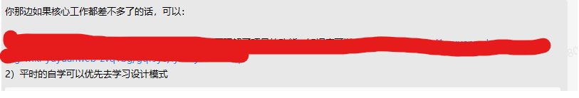
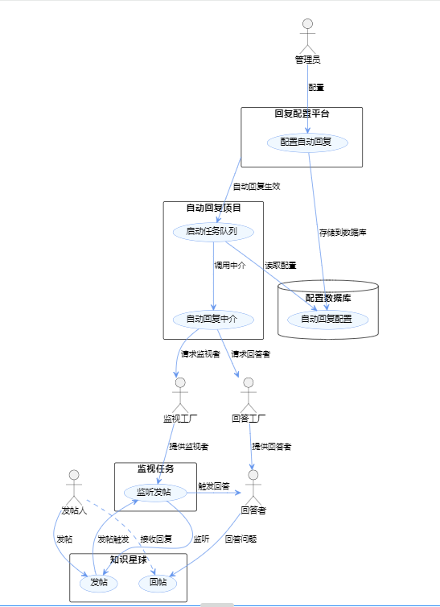

为什么突然更新设计模式呢?因为我的老板给我下了命令,让我学习设计模式。为什么从中介者模式开始呢?因为趁热打铁,我刚刚用中介者模式学会了如何制作自动回复机器人(这个以后可以出教程).


[中介者模式 | 菜鸟教程](https://www.runoob.com/design-pattern/mediator-pattern.html)
### 中介者模式（Mediator Pattern）
#### 什么是中介者模式？
中介者模式是一种行为设计模式，用于减少多个类之间的相互依赖，从而降低系统的耦合度。在这个模式中，通常会有一个单独的中介者类负责管理一组类（称为同事类）之间的交互。所有的同事类都通过中介者对象来通信，而不是直接相互引用。
#### 为什么使用中介者模式？

1. 降低耦合：减少类之间的直接依赖。
2. 集中控制逻辑：将交互逻辑从各个同事类中解耦并集中到一个中介者中。
3. 提高可维护性：由于交互逻辑在一个地方，因此更容易进行修改和维护。
#### 如何使用中介者模式？

1. 创建一个中介者接口或抽象类，定义用于与同事对象交互的方法。
2. 创建具体的中介者类实现这个接口。
3. 创建同事类，并将中介者对象作为参数传递到同事类中。
4. 同事类通过中介者对象进行所有交互。
#### 代码示例
```java
// 中介者接口
public interface Mediator {
    void sendMessage(String message, Colleague colleague);
}

// 具体的中介者类
public class ConcreteMediator implements Mediator {
    private ColleagueA colleagueA;
    private ColleagueB colleagueB;

    public void setColleagueA(ColleagueA colleagueA) {
        this.colleagueA = colleagueA;
    }

    public void setColleagueB(ColleagueB colleagueB) {
        this.colleagueB = colleagueB;
    }

    @Override
    public void sendMessage(String message, Colleague colleague) {
        if (colleague == colleagueA) {
            colleagueB.notify(message);
        } else {
            colleagueA.notify(message);
        }
    }
}

// 同事类抽象
public abstract class Colleague {
    protected Mediator mediator;

    public Colleague(Mediator mediator) {
        this.mediator = mediator;
    }

    public abstract void notify(String message);
}

// 同事类A
public class ColleagueA extends Colleague {
    public ColleagueA(Mediator mediator) {
        super(mediator);
    }

    public void send(String message) {
        mediator.sendMessage(message, this);
    }

    @Override
    public void notify(String message) {
        System.out.println("ColleagueA 得到消息：" + message);
    }
}

// 同事类B
public class ColleagueB extends Colleague {
    public ColleagueB(Mediator mediator) {
        super(mediator);
    }

    public void send(String message) {
        mediator.sendMessage(message, this);
    }

    @Override
    public void notify(String message) {
        System.out.println("ColleagueB 得到消息：" + message);
    }
}

// 测试代码
public class Main {
    public static void main(String[] args) {
        ConcreteMediator mediator = new ConcreteMediator();
        
        ColleagueA colleagueA = new ColleagueA(mediator);
        ColleagueB colleagueB = new ColleagueB(mediator);
        
        mediator.setColleagueA(colleagueA);
        mediator.setColleagueB(colleagueB);
        
        colleagueA.send("你好，B");
        colleagueB.send("你好，A");
    }
}
```
在这个例子中，`ConcreteMediator` 是中介者，负责协调 `ColleagueA` 和 `ColleagueB` 的通信。而 `ColleagueA` 和 `ColleagueB` 是同事类，它们通过 `ConcreteMediator` 来发送和接收消息。<br />这样，如果将来有更多的 `Colleague` 类，我们只需要修改 `ConcreteMediator` 而不是所有的 `Colleague` 类，从而实现了低耦合和高内聚。

## 工作中遇到的中介者模式
>ai自动回复机器人


假如我们要给知识星球的帖子做自动回复,中介者负责调度,生成监督者和回复者。监督者负责监听新消息,回复者在中介者的指挥下回复任务。这样设计的好处是即减少了耦合,同时还能支持多个任务的处理。比如我不仅要回复知识星球的消息,还要回复b站的消息,那么每个平台都有对应的监视者。再比如说你可能既有默认回复也有ai回复,这就需要不同的回答者。中介者模式起到了很好的调度作用,让这些角色各司其职。