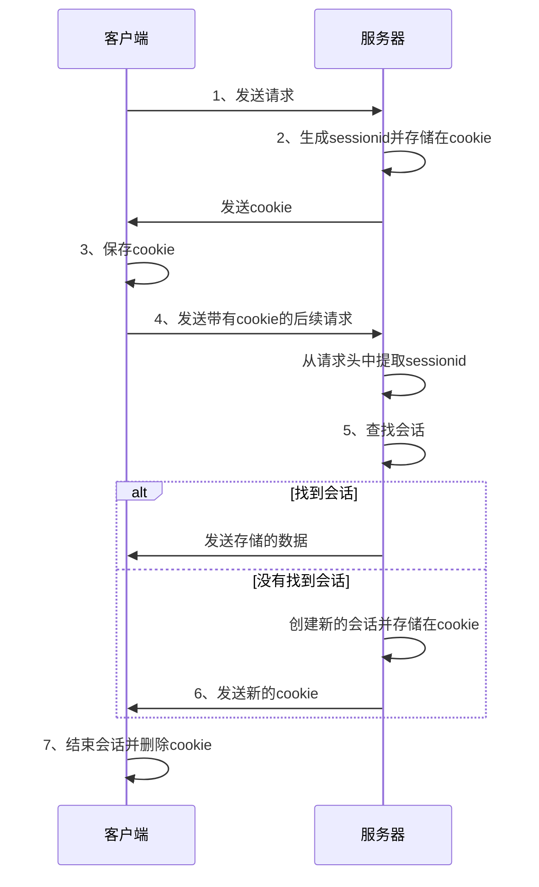

> 上周，我遇到了我在鱼厂的第一个大bug<br />

大家好，好几天没写博客了，因为我在被一个很恶心的bug所困扰。我给知识星球发自动回复的评论请求，神奇的发现了下面的问题：
# 问题描述
>我使用hutool的httpUtils向知识星球发送请求，意外的发现第一次请求是成功的，第二次请求却报错 401，于是，折磨就开始了。<br />

让我们先来看一下错误代码：<br />
```java
HttpRequest httpRequest = HttpRequest.post(url)
    .header("Connection", "close")
    .header("Access-Control-Request-Headers","content-type,x-request-id,x-signature,x-timestamp,x-version")
    .header("Accept","application/json, text/plain, */*")
    .header("cookie", cookie)
    .header("user-agent", USER_AGENT)
    .header("x-request-id", requestId)
    .header("x-signature", signature)
    .header("x-timestamp", timestamp)
    .body(json);
```
# 独立尝试

在问题出现的第一天，我通过各种搜索引擎，chatgpt，呼叫群友，尝试了包括但不限于的以下方法，未果：<br />
- 0. 加断点后，得到401错误码
- 1. 暂时删掉 `X-signare` 无效
- 2. 查找答案帖子和 chatgpt，询问他人后，尝试清除缓存，仍无效
- 3. 添加完整请求头，无效
- 4. 添加完整 `cookie`，有效，但该解决方案用户操作不方便，驳回

困扰了我两三天后，我终于忍不住让我的同时帮助我解决。
同事修改后的代码
```java
OkHttpClient client = new OkHttpClient().newBuilder()
                .build();
        MediaType mediaType = MediaType.parse("application/json");
        RequestBody body = RequestBody.create(mediaType, json);
        Request realRequest = new Request.Builder()
                .url(url)
                .method("POST", body)
                .addHeader("accept", "application/json, text/plain, */*")
                .addHeader("cookie", cookie)
                .addHeader("user-agent", "Mozilla/5.0 (Macintosh; Intel Mac OS X 10_15_7) AppleWebKit/537.36 (KHTML, like Gecko) Chrome/116.0.0.0 Safari/537.36")
                .addHeader("x-request-id", requestId)
                .addHeader("x-signature", signature)
                .addHeader("x-timestamp", timestamp)
                .build();
        Response response = null;
        String bodyStr = "";
        try {
            response = client.newCall(realRequest).execute();
            bodyStr = response.body().string();

        } catch (IOException e) {
            throw new BusinessException(ErrorCode.OPERATION_ERROR);
        }

        System.out.println(bodyStr);
        return JSONUtil.toBean(bodyStr, CommentResponse.class);
    }
```
# 问题排查

卧槽，这不就是换了个工具类吗？但仔细想想我的请求头参数完全一样，为什么okhttp3可以实现，而hutool却不行呢？于是，我又开始了探索。
探索的第一步是，我直接去了hutool的源码仓库，查看了很多issue。大家对httpUtils的意见很多。
<br />
搜索了大量issue中的问题后发现并没有什么卵用，于是！我就开始加断点地毯式搜索问题，果然，我发现在第一次发送请求后，响应头中出现了set-cookie字段，刚好401是和权限相关的，我想问题的原因应该就和cookie有关。
<br />
而且，两种工具类的返回内容并不相同，对于okhttp3，每次都会返回不同的sessionId，而hutool第一次返回了sessionId,后面报错401的时候却不返回了。
这时鱼皮给了我建议，现在你只能看到你请求的数据，但你不知道响应端拿到的cookie是什么，这时候你应该怎么做呢？没错，自己写一个服务端不就好了：<br />
```java
@RestController
@RequestMapping("/test")
public class TestController {

    @PostMapping("/setCookie")
    public ResponseEntity<String> setCookie(HttpServletRequest request, @RequestBody String requestBody) {
        // 从请求头获取Cookie
        String cookiesFromHeader = request.getHeader("Cookie");
        System.out.println("Received Cookies from header: " + cookiesFromHeader);


        // 从HttpServletRequest对象获取Cookie
        javax.servlet.http.Cookie[] cookies = request.getCookies();
        if (cookies != null) {
            for (javax.servlet.http.Cookie cookie : cookies) {
                System.out.println("Received Cookie from request object: " + cookie.getName() + "=" + cookie.getValue());
            }
        }

        HttpHeaders headers = new HttpHeaders();
        headers.put(HttpHeaders.SET_COOKIE, Collections.singletonList("zsxqsessionid=newSessionIdValue"));

        return ResponseEntity.ok()
                .headers(headers)
                .body("Cookie has been set");
    }

}
```
分别用两种工具进行测试
```java
public class NetTest {


    public static void main(String[] args) {
//        sendRequestWithOkHttp();
        sendRequestWithHutool();
    }

    public static void sendRequestWithOkHttp() {
        JsonObject json = new JsonObject();
        json.addProperty("key1", "value1");
        json.addProperty("key2", 42);
        json.addProperty("key3", true);

        OkHttpClient client = new OkHttpClient();
        MediaType mediaType = MediaType.parse("application/json");
        RequestBody requestBody = RequestBody.create(mediaType, json.toString());

        String url = "http://localhost:8081/test/setCookie";
        Request.Builder requestBuilder = new Request.Builder()
                .url(url)
                .method("POST", requestBody)
                .addHeader("accept", "application/json, text/plain, */*")
                .addHeader("cookie", "existingCookie=existingValue")
                .addHeader("user-agent", "Mozilla/5.0 (Macintosh; Intel Mac OS X 10_15_7) AppleWebKit/537.36 (KHTML, like Gecko) Chrome/116.0.0.0 Safari/537.36")
                .addHeader("x-request-id", "sdufisdgfs")
                .addHeader("x-signature", "sudhfisduf")
                .addHeader("x-timestamp","ss");

        for (int i = 1; i <= 2; i++) {
            try (Response response = client.newCall(requestBuilder.build()).execute()) {
                if (response.isSuccessful()) {
                    System.out.println("OkHttp - Request " + i + " successful");
                    System.out.println("Response body: " + response.body().string());
                } else {
                    System.out.println("OkHttp - Request " + i + " failed: " + response.message());
                }
            } catch (IOException e) {
                e.printStackTrace();
            }
        }
    }

    public static void sendRequestWithHutool() {
        Map<String, Object> jsonMap = new HashMap<>();
        jsonMap.put("key1", "value1");
        jsonMap.put("key2", 42);
        jsonMap.put("key3", true);

        HttpRequest request = HttpRequest.post("http://localhost:8081/test/setCookie")
                .header("accept", "application/json, text/plain, */*")
                .header("user-agent", "Mozilla/5.0 (Macintosh; Intel Mac OS X 10_15_7) AppleWebKit/537.36 (KHTML, like Gecko) Chrome/116.0.0.0 Safari/537.36")
                .header("x-request-id", "sdufisdgfs")
                .header("x-signature", "sudhfisduf")
                .header("x-timestamp", "ss")
                .header("Cookie", "existingCookie=existingValue")
                .body(JSONUtil.toJsonStr(jsonMap));

        for (int i = 1; i <= 2; i++) {
            HttpResponse response = request.execute();
            if (response.isOk()) {
                System.out.println("Hutool - Request " + i + " successful");
                System.out.println("Response body: " + response.body());
            } else {
                System.out.println("Hutool - Request " + i + " failed: " + response.getStatus());
            }
        }
    }
}
```
返回的结果
okhttp3：
<br />

hutool 的 httpRequest:
<br />
这里我们首先观察到，我用了两种不同的方式接收cookie。这是因为在之前我察觉到，其实cookie的接受来源除了请求头中固定写入，还有就是全局cookie。"全局cookie"通常是一个在多个子域或路径下都有效的cookie。与仅在特定子域或路径下有效的cookie相对应，全局cookie可以在整个网站或跨越多个网站使用。这意味着无论用户访问哪个页面或子域，全局cookie都可以读取和写入。这就是为什么，虽然我们的请求头cookie是硬编码写死的，但服务端仍然能够查看到hutool工具类里新接收到的sessionId
问题很明显，okhttp3不会主动保存返回的cookie内容（这里我查阅了资料，其实okhttp3也是可以保存cookie内容的，但是需要手动设置[cookieJAR](https://blog.csdn.net/weixin_45055749/article/details/122635365)），但hutool的工具类是会的，所以说两种工具类对cookie的处理是有区别的。
那么为什么okhttp3每次会返回不同的sessionId呢？而我在测试hutool工具类的时候为什么又不返回新的sessionId了呢？<br />
【这里我真的是吃了**基础不好**的亏啊】<br />
我们回顾一下session的工作原理。
>在相同浏览器下访问经过负载均衡的两个tomcat服务器，会出现什么情况？<br />
>第一次：访问Tomcat-A，Tomcat-A发现没有此次会话的JSESSIONID，然后重新创建了一个JSESSIONID，并通过cookie返回；<br />
>第N次：访问Tomcat-B，Tomcat-B同样会发现这个JSESSIONID没有相应的session信息，OK，就会再次创建一个JSESSIONID，并返回浏览器。<br />
>第N+1次：再次访问Tomcat-A的时候，发现在服务器上的找不到JSESSIONID相应的session，但是对用户来说确是一次未退出的访问。<br />
以下是Web会话的工作流程：<br />



# 原因分析
在这之后我还发现了查看全局cookie的方法，发现使用hutool的工具类每次cookie中的sessionId没有变化，再一次验证了这个想法<br />
```java
CookieManager cookieManager = GlobalCookieManager.getCookieManager();
CookieStore cookieStore = cookieManager.getCookieStore();
List<HttpCookie> cookies = cookieStore.getCookies();
```
<br />
*第一次没有存储sessionId，第二次发送的时候获得了sessionid*<br />

经过各种学习和尝试，我发现了问题的关键。所以，接下来我们分析一下两种工具类对cookie的处理过程中发生了什么。<br />
okhttp3:每次只发送token，没保存sessionId，所以每次都验证token，而给出一个新的sessionid（也就是没找到之前的session，因为连sessionId都没有保存到cookie，创建了一个新的会话。）<br />
hutool的httpRequest：第一次请求只发松了token，服务端发送了sessionId被保存进来。而第二次我们收到了401报错，由于对session的处理是由服务端决定的，这时我们可以合理推测，在用hutool发送请求给服务端时，服务端会认为每次请求都是一次新的访问，在响应后即立刻关闭了session，所以我们的sessionId失效，从而无权访问并报错401.<br />


# 收获与反思
1.token,session,cookie的区别<br />
Token、Cookie 和 Session 是用于管理 Web 应用程序中的状态和身份验证的三种不同机制。Token 通常是服务器生成的加密字符串，用于代表客户端的一次会话或特定权限，通常通过请求头传输。Cookie 是存储在客户端浏览器中的小段数据，用于跟踪用户状态或信息，可在多个请求间持久化。Session 是服务器端用于存储和管理用户数据的机制，它通常使用 Cookie 来保存一个唯一的 Session ID，以识别不同的客户端。总体来说，Token 常用于无状态的 RESTful API，Cookie 和 Session 主要用于有状态的 Web 应用。<br />
2.排查问题的思路<br />
这次问题排查其实走了不少弯路，鱼皮曾多次指导我，要发现变化的地方，找到问题的本质。其实这次写demo就是一个换位思考的过程。作为一个做过前端和后端的成需要，要学会考虑多方面的问题，从客户端和服务端双方的视角去看问题。<br />
3.解决问题的时候要敢于尝试，请教别人的时候也要敢于抒发自己的想法，每次都害怕失败，就永远解决不了问题。
